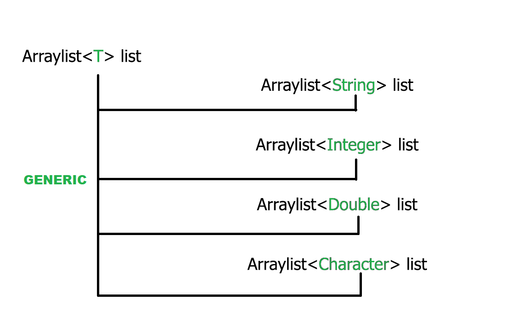

# Generics trong Java
### Giới thiệu:
#### Khái niệm generics được đưa vào kể từ java 5. Thuật ngữ “generics” được hiểu là tham số hóa kiểu dữ liệu. Việc tham số hóa kiểu dữ liệu giúp cho lập trình viên có thể dễ bắt lỗi các kiểu dữ liệu không hợp lệ, đồng thời giúp dễ dàng hơn cho việc tạo và sử dụng các class, interfaceGeneric, method với nhiều kiểu dữ liệu khác nhau
### Lí do cần sử dụng generics:
#### - Generics giúp tránh trường hợp ép kiểu không an toàn (unchecked casting) trong mã. Thay vì sử dụng Object và phải ép kiểu khi sử dụng, generics làm việc với kiểu dữ liệu cụ thể, giúp tránh nhầm lẫn và giảm thiểu lỗi kiểu dữ liệu.

### Các kiểu tham số thường dùng 
* T - Type (Kiểu dữ liệu bất kỳ thuộc Wrapper class: String, Integer, Long, Float, …)
* E – Element (phần tử – được sử dụng phổ biến trong Collection Framework)
* K – Key (khóa)
* V – Value (giá trị)
* N – Number (kiểu số: Integer, Double, Float, …)
U,S,I,G, … (tùy theo kiểu của người dùng đặt)
### Các kiểu Generic
1. Tạo class Generic với kiểu tham số generic
2. Kế thừa lớp Generics
3. Generic Interface
## Các thao tác Generic
1. Khởi tạo phương thức
2. khởi tạo đối tượng
3. Khởi tạo mảng
## Generic kí tự đại diện (?)
Trong Generic, dấu chấm hỏi (?) được gọi là một đại diện (wildcard), nó là kiểu không xác định.
 Wildcard có thể được sử dụng cho rất nhiều tính huống ví dụ như kiểu tham số, trường hoặc biến cục bộ; đôi khi là một kiểu trả về. Tùy vào ví trí của Wildcard mà nó sẽ có những ý nghĩa khác nhau:
- Collection<?>: mô tả một tập hợp chấp nhận tất cả các loại đối số (chứa mọi kiểu đối tượng).
- List<? extends Number>: mô tả một danh sách, nơi mà các phần tử là kiểu Number hoặc kiểu con của Number.
- Comparator<? super String>: Mô tả một bộ so sánh (Comparator) mà thông số phải là String hoặc cha của String.
